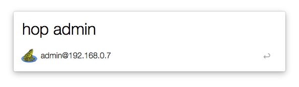

[Alfred](http://www.alfredapp.com/) [Workflow](http://support.alfredapp.com/workflows) that reads your 
[hop](https://github.com/Cue/hop) config to find your bookmarks to remote machines and allows you to 
quickly SSH into them in [iTerm2](https://iterm2.com).

